# Final Year Project Report

## **Chic Cercle — An AI-Powered Smart Wardrobe & Fashion Marketplace**

**Academic Institution:** ESPRIT — École Supérieure Privée d'Ingénierie et de Technologies  
**Academic Year:** 2025/2026  
**Project Type:** Final Year Engineering Project (PFE)  
**Application Package:** `tn.esprit.chiccercle`

---

## Table of Contents

1. [General Introduction](#1-general-introduction)
2. [Problem Statement & Objectives](#2-problem-statement--objectives)
3. [State of the Art](#3-state-of-the-art)
4. [Requirements Analysis](#4-requirements-analysis)
5. [System Architecture & Design](#5-system-architecture--design)
6. [Backend Implementation](#6-backend-implementation)
7. [Mobile Application Implementation](#7-mobile-application-implementation)
8. [AI Integration — Google Gemini](#8-ai-integration--google-gemini)
9. [Database Design](#9-database-design)
10. [Security & Authentication](#10-security--authentication)
11. [Deployment & DevOps](#11-deployment--devops)
12. [Testing](#12-testing)
13. [Screenshots & User Interface](#13-screenshots--user-interface)
14. [Conclusion & Perspectives](#14-conclusion--perspectives)

---

## 1. General Introduction

The fashion industry is evolving rapidly with the integration of technology, particularly artificial intelligence. Managing a personal wardrobe, coordinating outfits, and discovering new fashion items remain everyday challenges for individuals. **Chic Cercle** addresses these challenges by providing an intelligent mobile platform that combines wardrobe management, AI-assisted outfit generation, and a peer-to-peer fashion marketplace.

This report presents the design, architecture, and implementation of Chic Cercle — a full-stack mobile application developed as a final year project. The system consists of:

- A **native Android mobile application** built with Kotlin and Jetpack Compose
- A **RESTful backend API** built with NestJS (Node.js/TypeScript)
- **MongoDB** as the database
- **Google Gemini 1.5 Flash AI** for intelligent outfit recommendations
- **Firebase Cloud Messaging** for real-time push notifications
- **remove.bg API** for automatic clothing image background removal

---

## 2. Problem Statement & Objectives

### 2.1 Problem Statement

Many individuals face recurring daily challenges:
- **Outfit decision fatigue**: Spending excessive time choosing what to wear each day
- **Wardrobe disorganization**: Lack of a digital catalog of owned clothing items, leading to underutilization
- **Unused clothing**: Many items remain unworn due to poor outfit coordination and lack of style inspiration
- **No peer-to-peer clothing exchange**: No easy way to buy, sell, or trade fashion items within a trusted community

### 2.2 Objectives

| # | Objective | Description |
|---|-----------|-------------|
| 1 | **Digital Wardrobe** | Allow users to photograph, categorize, and manage their clothing items digitally with automatic background removal |
| 2 | **AI Outfit Generation** | Use Google Gemini's multimodal AI to suggest outfit combinations based on occasion, weather, mood, and clothing type |
| 3 | **Outfit Management** | Enable users to save, organize, and plan outfit assemblies for specific dates |
| 4 | **Fashion Marketplace** | Provide a marketplace where sellers can list items and buyers can send purchase requests |
| 5 | **Outfit Analysis** | Allow users to photograph their current outfit and receive AI-powered fashion feedback via CameraX |
| 6 | **Push Notifications** | Notify users in real-time about purchase requests and status updates via Firebase Cloud Messaging |

---

## 3. State of the Art

### 3.1 Existing Solutions

| Application | Digital Wardrobe | AI Suggestions | Marketplace | Background Removal | Open Source |
|-------------|:---:|:---:|:---:|:---:|:---:|
| Cladwell | ✅ | ✅ | ❌ | ❌ | ❌ |
| Stylebook | ✅ | ❌ | ❌ | ❌ | ❌ |
| Poshmark | ❌ | ❌ | ✅ | ❌ | ❌ |
| Vinted | ❌ | ❌ | ✅ | ❌ | ❌ |
| **Chic Cercle** | **✅** | **✅** | **✅** | **✅** | **✅** |

### 3.2 Chosen Technologies

| Layer | Technology | Justification |
|-------|-----------|---------------|
| Mobile | Kotlin + Jetpack Compose | Modern, declarative UI toolkit officially recommended by Google for Android |
| Backend | NestJS (TypeScript) | Modular, scalable Node.js framework with built-in dependency injection and decorator-based architecture |
| Database | MongoDB (Mongoose ODM) | Flexible NoSQL document-based schema ideal for variable clothing metadata |
| AI Engine | Google Gemini 1.5 Flash | Multimodal (text + image) AI model capable of analyzing clothing images alongside text descriptions |
| Auth | JWT + bcryptjs + Passport | Stateless, secure token-based authentication with password hashing |
| Notifications | Firebase Cloud Messaging | Cross-platform push notification service with high-priority Android support |
| Image Processing | remove.bg API | Professional-grade automatic background removal for clean clothing photos |
| Containerization | Docker + Docker Compose | Consistent, reproducible deployment environment |
| API Documentation | Swagger/OpenAPI | Interactive API documentation with Bearer token support |

---

## 4. Requirements Analysis

### 4.1 Functional Requirements

**FR1 — Authentication Module**
- User registration with email/password (bcryptjs hashing, salt=10)
- Google OAuth sign-in with automatic profile picture download and storage
- Login with role-based access control (client, seller, admin, banned)
- JWT access tokens (3-day expiry) with UUID-based refresh token rotation
- Password reset via SMTP email with tokenized link (3-hour expiry)
- Change password with old password verification
- Banned user rejection at login and profile access

**FR2 — Wardrobe Management (Closet)**
- Add clothing items with photo capture, type, color, occasion, mood, and weather tags
- Automatic background removal via remove.bg API on uploaded clothing photos
- Multi-criteria filtering: by `Occasion[]`, `Moods[]`, `Weather[]`, `TypesC[]`, `colors[]`
- Full CRUD operations on clothing items
- Clothing organized per user with `user` field reference

**FR3 — Outfit Assembly (Get Ready)**
- Create outfit combinations from wardrobe items (array of `Clothes` ObjectId references)
- Schedule outfits for specific dates with name and optional image
- Populate clothes data when fetching assemblies (Mongoose `.populate('clothes')`)
- AI-powered outfit suggestion via Gemini with per-type options (enable/disable, color preference, specific item ID)

**FR4 — AI Outfit Generation**
- User selects desired clothing categories (shirt, pants, shoes, etc.) with optional color preferences
- Backend filters matching clothes from DB using dynamic MongoDB query construction
- Clothing images read from disk, converted to base64 for multimodal Gemini input
- AI analyzes both images and text metadata to suggest coordinated outfits
- Returns specific clothing item IDs for the recommended outfit

**FR5 — Fashion Marketplace**
- Sellers list clothes/outfits with prices visible to all users
- Buyers browse marketplace and send purchase requests (duplicate prevention by `clientId + itemId`)
- Seller accepts/rejects requests
- On acceptance: automatic ownership transfer (clothing `user` field updated, `price` reset to 0)
- All competing requests for same item automatically deleted on acceptance

**FR6 — User Profile**
- View and edit personal profile (name, phone, birthday, height, weight, shape, location, gender)
- Profile picture upload and management via Files module
- View owned clothes and assemblies count

**FR7 — Notifications**
- Firebase push notifications for request updates
- Android high-priority notifications with sound and default channel

### 4.2 Non-Functional Requirements

| Requirement | Description |
|-------------|-------------|
| **Performance** | Retrofit timeouts configured at 30s connect/read/write; API response time < 2s for standard CRUD |
| **Security** | Passwords hashed with bcryptjs (salt=10), JWT Bearer authentication, AuthenticationGuard on protected routes |
| **Scalability** | Modular NestJS architecture with independent modules; each module exportable and injectable |
| **Usability** | Material Design 3 UI with Jetpack Compose; custom themed components; responsive layouts |
| **Availability** | Docker containerization with Docker Compose orchestration; persistent MongoDB volume |
| **Maintainability** | MVVM architecture on mobile; modular NestJS backend; clear separation of concerns |

### 4.3 Actors

| Actor | Role | Permissions |
|-------|------|-------------|
| **Client** | Regular user | Manage wardrobe, create outfits, buy items, use AI features, edit profile |
| **Seller** | Vendor | All client permissions + list items for sale, manage purchase requests (accept/reject) |
| **Admin** | Administrator | Full system access, user management, ban users |

### 4.4 Use Case Diagram

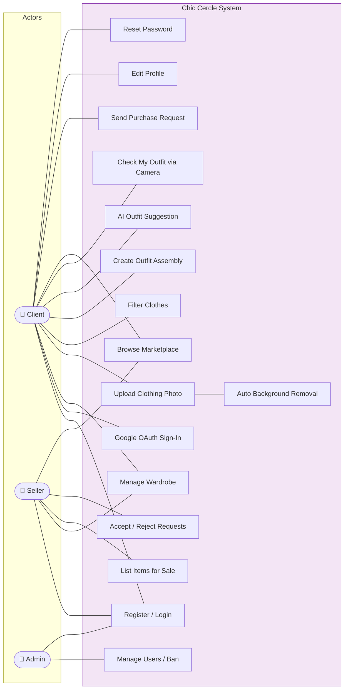

### 4.5 Class Diagram

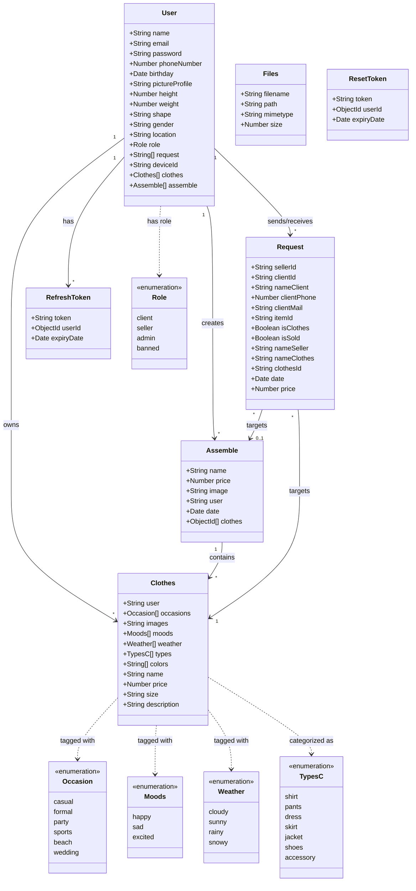

---

## 5. System Architecture & Design

### 5.1 Global Architecture

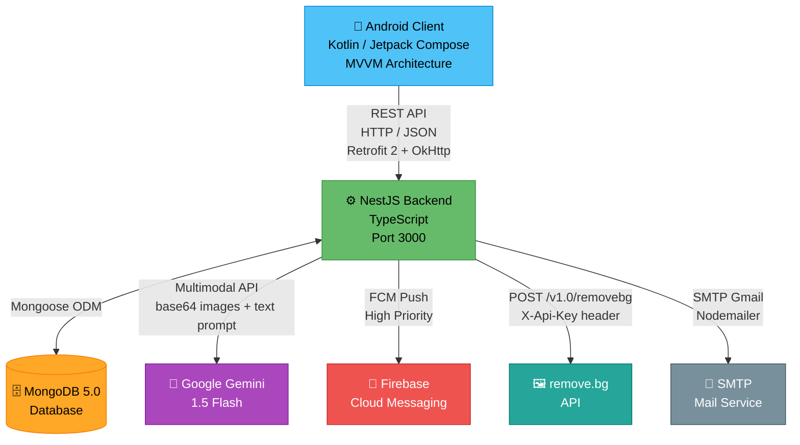

### 5.2 Backend Architecture (NestJS Modules)

The backend follows NestJS's modular architecture pattern where each feature is encapsulated in its own module with its own controller, service, DTOs, and entities. Modules declare dependencies through imports and make functionality available through exports.

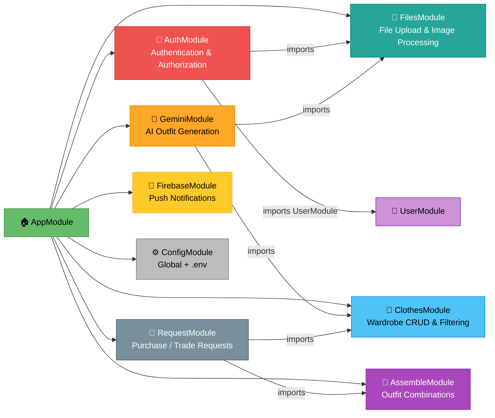

**Module Dependency Graph**: `AuthModule` imports `UserModule` and `FilesModule` (for Google profile picture download). `GeminiModule` imports `ClothesModule` and `FilesModule` (to read clothing images for AI). `RequestModule` imports `ClothesModule` and `AssembleModule` (for ownership transfer on purchase acceptance).

### 5.3 Mobile Architecture (MVVM)

The Android application follows the **Model-View-ViewModel (MVVM)** pattern with clear separation between UI (Compose), state management (ViewModel), and data access (Retrofit + Room).

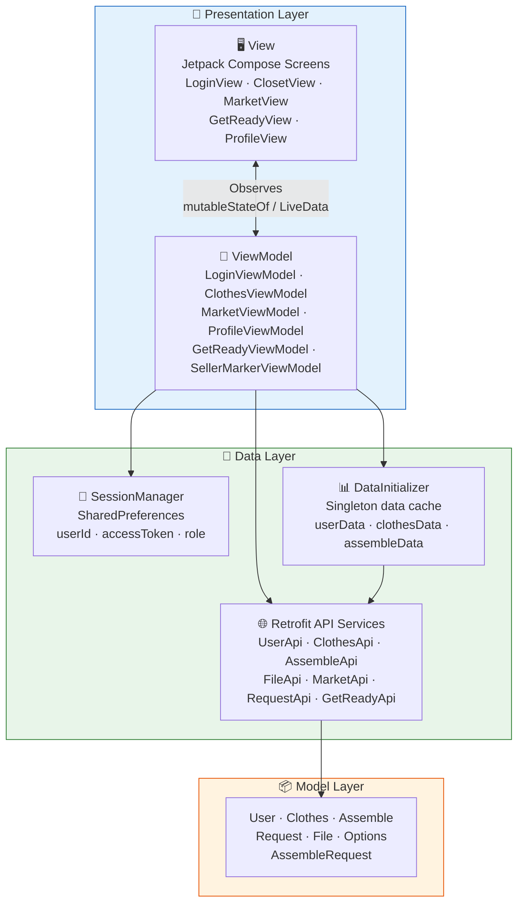

### 5.4 Navigation Architecture

The application uses a **nested navigation** architecture with a parent `NavHostController` for auth/main flow and a child `NavHostController` for bottom navigation tabs.

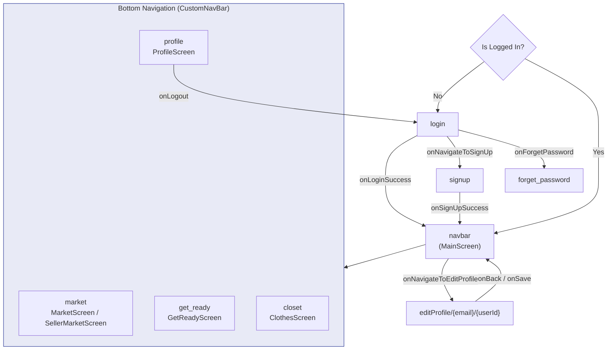

**Key Navigation Logic** from `MainActivity.kt`:
```kotlin
// Role-based marketplace routing
composable("market") {
    if (isSeller) {
        SellerMarketScreen(requestViewModel = SellerMarkerViewModel())
    } else {
        MarketScreen()  // Buyer marketplace
    }
}
```

---

## 6. Backend Implementation

### 6.1 Technology Stack

| Component | Technology | Version | Purpose |
|-----------|-----------|---------|---------|
| Runtime | Node.js | 18 (Alpine) | JavaScript runtime |
| Framework | NestJS | 10.x | Modular backend framework |
| Language | TypeScript | 5.x | Type-safe development |
| Database | MongoDB | 5.0 | Document store |
| ODM | Mongoose | 8.8 | Schema-based modeling |
| Authentication | Passport + JWT | 10.x | Token-based auth |
| Password Hashing | bcryptjs | 2.4.3 | Secure password storage |
| API Documentation | Swagger (OpenAPI) | 8.x | Interactive API docs |
| AI | Google Generative AI SDK | 0.21 | Gemini API client |
| Notifications | Firebase Admin SDK | 13.x | FCM push notifications |
| Email | Nodemailer | 6.x | SMTP mail service |
| File Upload | Multer | built-in | Disk-based file storage |
| Background Removal | remove.bg API | v1.0 | Image processing |

### 6.2 Module Details

#### 6.2.1 Auth Module — Detailed Implementation

The Auth module handles all authentication flows. It is the most complex module, managing JWT tokens, refresh token rotation, Google OAuth, and password reset.

**Registration Flow** (`AuthService.signup()`):
```typescript
async signup(signupData: signUpDto) {
    const emailInUse = await this.UserModel.findOne({ email: signupData.email });
    if (emailInUse) {
        throw new BadRequestException('Email is already in use');
    }
    const hashedPassword = await bcrypt.hash(signupData.password, 10);
    const user = await this.UserModel.create({
        ...signupData,
        password: hashedPassword,
    });
    const payload = {
        userId: user._id.toString(),
        email: user.email,
        role: user.role,
    };
    const tokens = await this.generatedUserToken(payload);
    return { ...tokens, role: user.role, userId: user._id };
}
```

**Token Generation Algorithm** (`AuthService.generatedUserToken()`):
```typescript
async generatedUserToken(payload: { userId: string, email: string, role: string }) {
    const accessToken = this.jwtService.sign(payload, { expiresIn: '3d' });
    const refreshToken = uuidv4();  // UUID-based refresh token
    await this.storeRefreshToken(refreshToken, payload.userId);
    return { accessToken, refreshToken };
}

async storeRefreshToken(token: string, userId) {
    const expiryDate = new Date();
    expiryDate.setDate(expiryDate.getDate() + 3);
    await this.RefreshTokenModel.create({ token, userId, expiryDate });
}
```

**Google OAuth Flow** (`AuthService.googleAccess()`):
```typescript
async googleAccess(signupData: signUpDto) {
    const emailInUse = await this.UserModel.findOne({ email: signupData.email });
    const imageUrl = signupData.pictureProfile;
    
    if (emailInUse) {
        // Existing user: login directly
        const tokens = await this.generatedUserToken({...});
        return { ...tokens, signUp: false };
    }
    
    // New user: download Google profile picture and create account
    let fileIdFromFunction = await this.fileService.downloadImageAndUpload(imageUrl);
    const user = await this.UserModel.create({
        ...signupData,
        pictureProfile: fileIdFromFunction
    });
    const tokens = await this.generatedUserToken({...});
    return { ...tokens, signUp: true };
}
```

**JWT Authentication Guard** (`AuthenticationGuard`):
```typescript
@Injectable()
export class AuthenticationGuard implements CanActivate {
    constructor(private jwtService: JwtService) {}

    canActivate(context: ExecutionContext): boolean | Promise<boolean> {
        const request = context.switchToHttp().getRequest();
        const token = this.extractTokenFromHeader(request);
        if (!token) throw new UnauthorizedException('Invalid token');
        try {
            const payload = this.jwtService.verify(token);
            request.user = payload;  // Attach decoded user to request
        } catch (e) {
            throw new UnauthorizedException('Invalid Token');
        }
        return true;
    }

    private extractTokenFromHeader(request: Request): string | undefined {
        return request.headers.authorization?.split(' ')[1];
    }
}
```

**Password Reset Flow**:
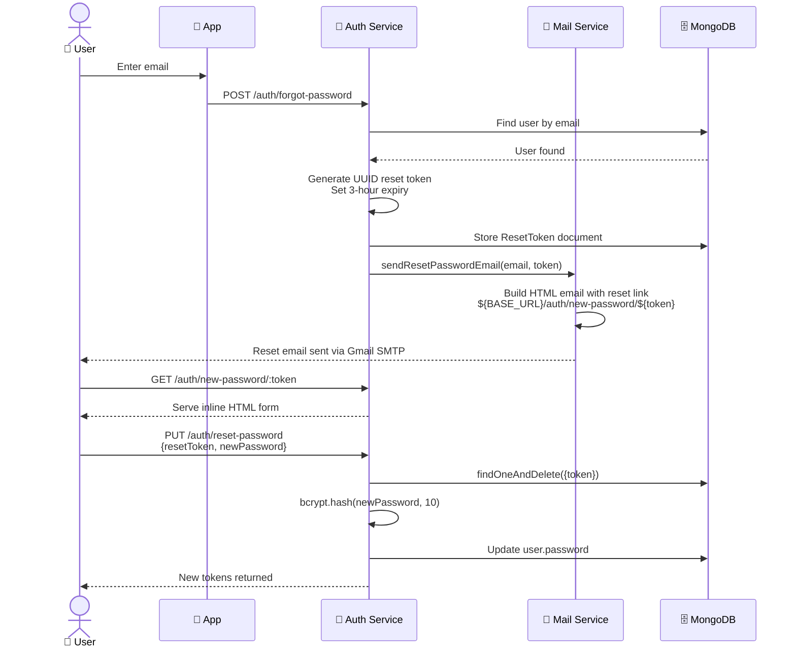

**Mail Service Implementation**:
```typescript
@Injectable()
export class MailService {
    private transporter = nodemailer.createTransport({
        service: 'gmail',
        auth: {
            user: process.env.EMAIL_USER,
            pass: process.env.EMAIL_PASS,
        },
    });

    async sendResetPasswordEmail(userEmail: string, token: string) {
        const resetUrl = `${process.env.BASE_URL}/auth/new-password/${token}`;
        await this.transporter.sendMail({
            from: `"Votre Application" <${process.env.EMAIL_USER}>`,
            to: userEmail,
            subject: 'Réinitialisation de votre mot de passe',
            html: `
                <h3>Réinitialiser votre mot de passe</h3>
                <p>Cliquez sur le lien ci-dessous :</p>
                <a href="${resetUrl}">Réinitialiser mon mot de passe</a>
            `,
        });
    }
}
```

**Endpoints Summary**:
| Method | Route | Auth | Description |
|--------|-------|------|-------------|
| POST | `/auth/signUp` | No | Register with email/password |
| POST | `/auth/google` | No | Google OAuth sign-in/up |
| POST | `/auth/login` | No | Email/password login |
| POST | `/auth/refresh` | No | Exchange refresh token |
| PUT | `/auth/change-password` | Yes (Guard) | Change password |
| POST | `/auth/forgot-password` | No | Send reset email |
| PUT | `/auth/reset-password` | No | Reset with token |
| GET | `/auth/new-password/:token` | No | Serve reset HTML form |

---

#### 6.2.2 Clothes Module — Multi-Criteria Filtering Engine

The Clothes module provides full CRUD plus a dynamic filtering engine that constructs MongoDB queries from multiple optional criteria.

**Dynamic Filter Construction** (`ClothesService.getClothesForCriteria()`):
```typescript
async getClothesForCriteria(outfitDto: CreateClotheDto): Promise<Clothes[]> {
    const filter: any = {};
    
    // Each criterion is optional — only add to filter if provided
    if (outfitDto.occasions && outfitDto.occasions.length > 0) {
        filter.occasions = { $in: outfitDto.occasions };
    }
    if (outfitDto.moods && outfitDto.moods.length > 0) {
        filter.moods = { $in: outfitDto.moods };
    }
    if (outfitDto.weather && outfitDto.weather.length > 0) {
        filter.weather = { $in: outfitDto.weather };
    }
    if (outfitDto.colors && outfitDto.colors.length > 0) {
        filter.colors = { $in: outfitDto.colors };
    }
    if (outfitDto.types && outfitDto.types.length > 0) {
        filter.types = { $in: outfitDto.types };
    }
    if (outfitDto.user) {
        filter.user = outfitDto.user;
    }
    
    return await this.clothesModel.find(filter).exec();
}
```

This uses MongoDB's `$in` operator to match any document where the array field contains at least one of the specified values, enabling flexible multi-tag filtering.

**Clothing Schema** (Mongoose):
```typescript
@Schema()
export class Clothes extends Document {
    @Prop() user: string;
    @Prop({ type: [String], enum: Occasion }) occasions: Occasion[];
    @Prop() images?: string;  // File ID reference
    @Prop({ type: [String], enum: Moods }) moods: Moods[];
    @Prop({ type: [String], enum: Weather }) weather: Weather[];
    @Prop({ type: [String], enum: TypesC }) types: TypesC[];
    @Prop({ type: [String] }) colors: string[];
    @Prop({ type: String }) name: string;
    @Prop() price: number;
    @Prop() size?: string;
    @Prop() description?: string;
}
```

**Enumerations**:
```typescript
export enum Occasion { CASUAL='casual', FORMAL='formal', PARTY='party', 
                        SPORTS='sports', BEACH='beach', WEDDING='wedding' }
export enum Moods    { HAPPY='happy', SAD='sad', EXCITED='excited' }
export enum Weather  { CLOUDY='cloudy', SUNNY='sunny', RAINY='rainy', SNOWY='snowy' }
export enum TypesC   { SHIRT='shirt', PANTS='pants', DRESS='dress', SKIRT='skirt',
                       JACKET='jacket', SHOES='shoes', ACCESSORY='accessory' }
```

---

#### 6.2.3 Assemble Module — Outfit Combinations with Population

The Assemble module manages outfit combinations. Key feature: **Mongoose populate** is used to join clothing references with full clothing data.

```typescript
async findAll(): Promise<Assemble[]> {
    return this.assembleModel.find().populate('clothes').exec();
    // Replaces ObjectId[] with full Clothes documents
}

async findOne(id: string): Promise<Assemble | null> {
    return await this.assembleModel.findById(id).populate('clothes').exec();
}
```

**Assemble Schema**:
```typescript
@Schema()
export class Assemble extends Document {
    @Prop() name: string;
    @Prop() price: number;
    @Prop() image: string;
    @Prop() user: string;
    @Prop() date: Date;
    @Prop({ type: [{ type: Types.ObjectId, ref: 'Clothes' }] })
    clothes: Types.ObjectId[];  // References populated at query time
}
```

---

#### 6.2.4 Files Module — Upload Pipeline with Background Removal

The Files module implements a sophisticated upload pipeline with automatic background removal for clothing photos.

**Upload Pipeline Flow**:
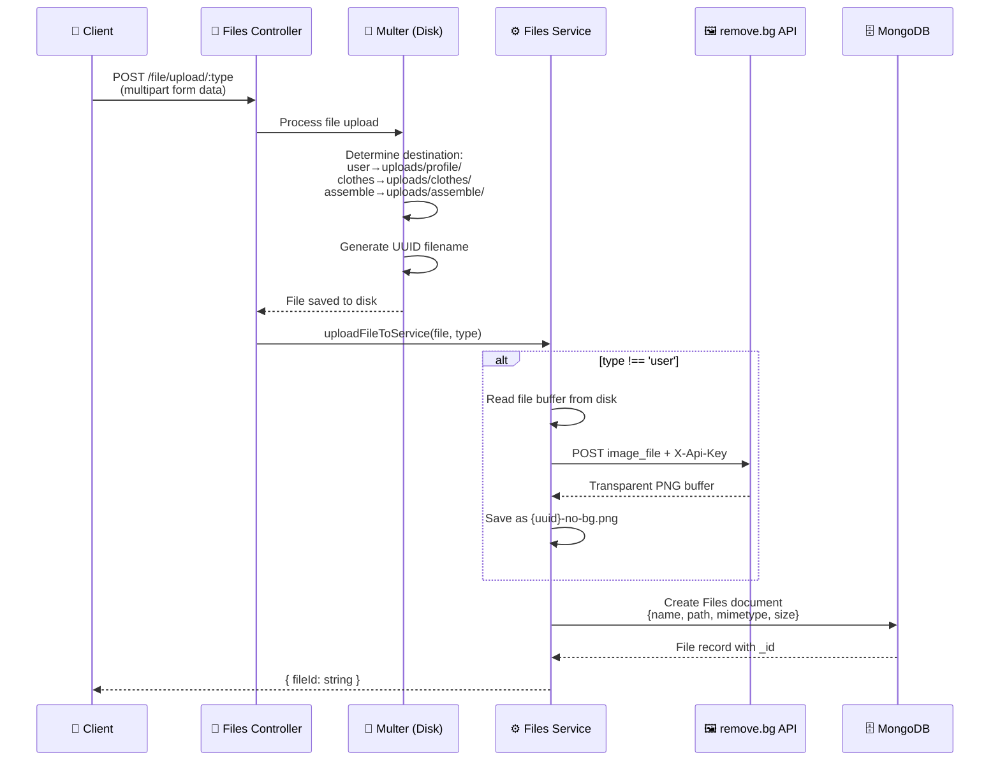

**Background Removal Implementation**:
```typescript
async removeBg(buffer: Buffer): Promise<Buffer> {
    const formData = new FormData();
    const blob = new Blob([buffer], { type: 'image/jpeg' });
    formData.append('size', 'auto');
    formData.append('image_file', blob, 'file.jpg');
    
    const response = await fetch('https://api.remove.bg/v1.0/removebg', {
        method: 'POST',
        headers: { 'X-Api-Key': process.env.REMOVE_BG_API_KEY },
        body: formData,
    });
    
    if (response.ok) {
        const arrayBuffer = await response.arrayBuffer();
        return Buffer.from(arrayBuffer);
    } else {
        throw new Error(`${response.status}: ${response.statusText}`);
    }
}
```

**Multer Disk Storage Configuration** (dynamic folder routing):
```typescript
storage: diskStorage({
    destination: (req, file, callback) => {
        const { type } = req.params;
        let folder = 'uploads/';
        if (type === 'user') { folder += 'profile/'; }
        else if (type === 'clothes') { folder += 'clothes/'; }
        else if (type === 'assemble') { folder += 'assemble/'; }
        fs.mkdirSync(folder, { recursive: true });
        callback(null, folder);
    },
    filename: (req, file, callback) => {
        const uniqueSuffix = `${uuidv4()}${extname(file.originalname)}`;
        callback(null, uniqueSuffix);
    },
}),
```

---

#### 6.2.5 Request Module — Marketplace Transaction Engine

The Request module implements the core marketplace business logic, including purchase request management and automatic ownership transfer.

**Ownership Transfer Algorithm** (`RequestService.update()`):
```typescript
async update(id: string, updateRequestDto: UpdateRequestDto): Promise<Request> {
    const request = await this.requestModel.findById(id).exec();
    if (!request) throw new NotFoundException();

    if (updateRequestDto.isClothes) {
        // Transfer clothing item ownership
        const clothe = await this.clothesService.findOne(updateRequestDto.itemId);
        clothe.user = updateRequestDto.clientId;  // Transfer to buyer
        clothe.price = 0;                          // Reset price (no longer for sale)
        await clothe.save();
    } else {
        // Transfer assemble ownership
        const assemble = await this.assembleService.findOne(updateRequestDto.itemId);
        assemble.user = updateRequestDto.clientId;
        assemble.price = 0;
        await assemble.save();
    }

    // Delete all competing requests for the same item
    await this.requestModel.deleteMany({
        clothesId: updateRequestDto.clothesId,
        clientId: { $ne: updateRequestDto.clientId }  // Keep winner's request
    }).exec();

    request.isSold = true;
    await request.save();
    return request;
}
```

**Duplicate Prevention** (Controller level):
```typescript
@Post()
async create(@Body() createRequestDto: CreateRequestDto): Promise<Request> {
    const existingRequest = await this.requestService.findOneByUniqueFields(
        createRequestDto.clientId, 
        createRequestDto.itemId
    );
    if (existingRequest) {
        throw new NotFoundException('Request already sent');
    }
    return this.requestService.create(createRequestDto);
}
```

---

#### 6.2.6 Firebase Module — Push Notification System

```typescript
// Provider pattern for Firebase initialization
export const firebaseAdminProvider = {
    provide: 'FIREBASE_ADMIN',
    useFactory: () => {
        const defaultApp = admin.initializeApp({
            credential: admin.credential.cert({
                projectId: process.env.PROJECT_ID,
                clientEmail: process.env.CLIENT_EMAIL,
                privateKey: process.env.PRIVATE_KEY?.replace(/\\n/g, '\n'),
            }),
        });
        return { defaultApp };
    },
};

// Push notification with platform-specific configuration
async sendPush(notification: CreateFirebaseDto) {
    await admin.messaging().send({
        notification: { title: notification.title, body: notification.body },
        token: notification.deviceId,
        android: {
            priority: 'high',
            notification: { sound: 'default', channelId: 'default' },
        },
        apns: {
            headers: { 'apns-priority': '10' },
            payload: { aps: { contentAvailable: true, sound: 'default' } },
        },
    });
}
```

### 6.3 API Documentation

The API is documented using **Swagger/OpenAPI** with Bearer auth support:

```typescript
export function setupSwagger(app: INestApplication): void {
    const config = new DocumentBuilder()
        .setTitle('ChicCircle')
        .setDescription('tester les Api de chicCircle')
        .setVersion('1.0')
        .addBearerAuth()
        .build();
    const document = SwaggerModule.createDocument(app, config);
    SwaggerModule.setup('api', app, document);
}
```

Accessible at `http://localhost:3000/api` with interactive testing capabilities.

---

## 7. Mobile Application Implementation

### 7.1 Technology Stack

| Component | Technology | Version | Purpose |
|-----------|-----------|---------|---------|
| Language | Kotlin | latest | Primary language |
| UI Framework | Jetpack Compose | 1.5.x | Declarative UI |
| UI Design System | Material 3 | 1.3.1 | Modern Material Design |
| Architecture | MVVM | — | Separation of concerns |
| Navigation | Navigation Compose | 2.7.3 | Screen navigation |
| Networking | Retrofit 2 + OkHttp | 2.9 | REST API client |
| JSON Parsing | Gson | via Retrofit | Serialization |
| Image Loading | Coil | 2.1.0 | Async image loading |
| Local Storage | SharedPreferences | built-in | Session management |
| Camera | CameraX | 1.4.0 | Photo capture |
| AI (on-device) | Google Generative AI SDK | 0.9.0 | On-device Gemini |
| Permissions | Accompanist | 0.30.1 | Runtime permissions |
| Pager | Accompanist Pager | 0.36.0 | Sign-up wizard |
| Min SDK | 24 | Android 7.0 | Minimum target |
| Target SDK | 34 | Android 14 | Target platform |

### 7.2 Retrofit Configuration

The network layer is configured as a singleton object with centralized API access:

```kotlin
object MyRetrofit {
    private const val BASE_URL = "http://192.168.43.95:3000/"
    
    val okHttpClient = OkHttpClient.Builder()
        .connectTimeout(30, TimeUnit.SECONDS)
        .writeTimeout(30, TimeUnit.SECONDS)
        .readTimeout(30, TimeUnit.SECONDS)
        .build()
    
    private val retrofit: Retrofit by lazy {
        Retrofit.Builder()
            .baseUrl(BASE_URL)
            .client(okHttpClient)
            .addConverterFactory(GsonConverterFactory.create())
            .build()
    }
    
    val userAPI: UserAPI by lazy { retrofit.create(UserAPI::class.java) }
    val fileApi: FileApi by lazy { retrofit.create(FileApi::class.java) }
    val clothesApi: ClothesApi by lazy { retrofit.create(ClothesApi::class.java) }
    val assembleApi: AssembleApi by lazy { retrofit.create(AssembleApi::class.java) }
    val marketAPI: MarketAPI by lazy { retrofit.create(MarketAPI::class.java) }
    val requestApi: RequestApi by lazy { retrofit.create(RequestApi::class.java) }
    val getReadyApi: GetReadyApi by lazy { retrofit.create(GetReadyApi::class.java) }
}
```

### 7.3 Session Management

Session persistence uses Android `SharedPreferences` to store authentication state:

```kotlin
class SessionManager {
    companion object {
        private const val PREF_NAME = "user_session"
        private const val KEY_USER_ID = "USER_ID"
        private const val KEY_ACCESS_TOKEN = "ACCESS_TOKEN"
        private const val KEY_ROLE = "ROLE"
        private var sharedPreferences: SharedPreferences? = null

        fun initialize(context: Context) {
            sharedPreferences = context.getSharedPreferences(PREF_NAME, Context.MODE_PRIVATE)
        }
    }

    fun saveUserId(userId: String) {
        editor.putString(KEY_USER_ID, userId).apply()
        GlobalScope.launch {
            DataInitializer.initializeData(userId)  // Auto-fetch user data on login
        }
    }
    
    fun clearSession() { editor.clear().apply() }  // Logout
}
```

### 7.4 Data Initialization Pattern

The `DataInitializer` singleton acts as an in-memory cache layer that pre-fetches and stores user data, clothes, assemblies, and requests on login:

```kotlin
class DataInitializer {
    companion object {
        private var userData: User = User(...)
        private var clothesData: List<Clothes> = emptyList()
        private var assembleData: List<Assemble> = emptyList()
        private var requestData: List<Request> = emptyList()

        suspend fun initializeData(userId: String): Response<User>? {
            val response = MyRetrofit.userAPI.getUserById(userId)
            if (response.isSuccessful) {
                val body = response.body()
                if (body != null) {
                    userData = body
                    clothesData = body.clothes as List<Clothes>
                    assembleData = body.assemble as List<Assemble>
                }
                // Sellers also fetch all marketplace requests
                if (userData.role == "seller") {
                    val responseRequest = MyRetrofit.requestApi.getAllRequests()
                    responseRequest.body()?.let { requestData = it }
                }
            }
            return response
        }
    }
}
```

### 7.5 Data Models (Kotlin)

```kotlin
data class User(
    val name: String, val email: String, val password: String,
    val phoneNumber: Int? = null, val role: String,
    val pictureProfile: String? = null, val birthday: Date? = null,
    val clothes: List<Clothes?>, val assemble: List<Assemble?>,
    val height: Int? = null, val weight: Int? = null,
    val shape: String? = null, val location: String? = null
) : Serializable

data class Clothes(
    @SerializedName("_id") val id: String,
    val user: String, val images: String?,
    val occasions: List<String>, val moods: List<String>,
    val weather: List<String>, val types: List<String>? = null,
    val colors: List<String>, val price: Double? = null,
    val name: String? = null, val description: String? = null,
    val size: String? = null
)

data class Assemble(
    @SerializedName("_id") val id: String,
    val user: String, val name: String, val price: Double,
    val image: String?, val clothes: List<String>, val date: Date
)

data class Request(
    @SerializedName("_id") val id: String?,
    val sellerId: String?, val clientId: String?,
    val nameClient: String?, val clientPhone: Int?,
    val clientMail: String?, val itemId: String?,
    val isClothes: Boolean?, val isSold: Boolean?,
    val nameSeller: String?, val nameClothes: String?,
    var PriceClothes: Double?
)

data class Options(
    val enable: Boolean, val type: String,
    val id: String? = null, val color: String? = null
)

data class AssembleRequest(
    val options: List<Options>, val clothe: Clothes
)
```

### 7.6 ViewModel Pattern — LoginViewModel Example

```kotlin
class LoginViewModel : ViewModel() {
    val email = mutableStateOf("")
    val password = mutableStateOf("")
    val snackbarMessage = mutableStateOf("")
    private val sessionManager = SessionManager()

    fun login(onSuccess: () -> Unit, onError: (String) -> Unit) {
        viewModelScope.launch(Dispatchers.IO) {
            try {
                val response = MyRetrofit.userAPI.login(
                    LoginRequest(email.value, password.value)
                )
                if (response.isSuccessful) {
                    val body = response.body()
                    if (body != null) {
                        sessionManager.saveUserId(body.userId)
                        sessionManager.saveAccessToken(body.accessToken)
                        sessionManager.saveRole(body.role)
                        withContext(Dispatchers.Main) { onSuccess() }
                    }
                } else {
                    withContext(Dispatchers.Main) {
                        onError("Login failed: ${response.message()}")
                    }
                }
            } catch (e: Exception) {
                withContext(Dispatchers.Main) {
                    onError("Error occurred: ${e.localizedMessage}")
                }
            }
        }
    }

    fun validateLogin(): Boolean {
        if (email.value.isEmpty()) { snackbarMessage.value = "Email cannot be empty"; return false }
        if (password.value.isEmpty()) { snackbarMessage.value = "Password cannot be empty"; return false }
        return true
    }
}
```

### 7.7 API Interfaces

```kotlin
interface UserAPI {
    @POST("auth/signUp") suspend fun signup(@Body user: User): Response<LoginResponse>
    @POST("auth/login") suspend fun login(@Body request: LoginRequest): Response<LoginResponse>
    @GET("user/{id}") suspend fun getUserById(@Path("id") userId: String): Response<User>
    @PATCH("user/{id}") suspend fun updateUser(@Path("id") userId: String, @Body dto: User): Response<User>
    @POST("/auth/forgot-password") suspend fun sendPasswordResetLink(@Body email: String): Response<Void>
}

interface ClothesApi {
    @GET("clothes/getByUser/{userId}") suspend fun getClothesByUserId(@Path("userId") userId: String): List<Clothes>
    @POST("clothes/addclothes") suspend fun addClothes(@Body newClothes: Clothes): Response<ClothesResponse>
    @PATCH("clothes/{clothingId}") suspend fun updateClothes(@Path("clothingId") id: String, @Body c: Clothes): Response<Clothes>
    @DELETE("clothes/{clothingId}") suspend fun deleteClothes(@Path("clothingId") id: String): Response<Void>
}

interface GetReadyApi {
    @POST("gemini/generate")
    suspend fun generateAssemble(@Body assembleRequest: AssembleRequest): Response<List<Clothes>>
}

interface FileApi {
    @Multipart @POST("file/upload/{type}")
    fun uploadFile(@Path("type") type: String, @Part file: MultipartBody.Part): Call<UploadResponse>
    @GET("file/{id}") @Streaming
    fun getFile(@Path("id") id: String): Call<ResponseBody>
}

interface RequestApi {
    @POST("request") suspend fun createRequest(@Body dto: Request): Response<Request>
    @GET("request") suspend fun getAllRequests(): Response<List<Request>>
    @PATCH("request/{id}") suspend fun updateRequest(@Path("id") id: String, @Body dto: Request): Response<Request>
    @DELETE("request/{id}") suspend fun deleteRequest(@Path("id") id: String): Response<Unit>
}
```

### 7.8 Key Screens

| Screen | View File | ViewModel | Key Features |
|--------|-----------|-----------|--------------|
| **Login** | `LoginView.kt` | `LoginViewModel` | Email/password fields, Google OAuth, validation, Snackbar errors |
| **Sign Up** | `SignUpView.kt` + `SubView1/2/3.kt` | `SignUpViewModel` | 3-step Accompanist Pager wizard |
| **Closet** | `ClosetView.kt` | `ClothesViewModel` | Grid display, add/edit/delete clothes, filter chips, image upload with background removal |
| **Get Ready** | `GetReadyView.kt` | `GetReadyViewModel` | Outfit assembly creation, AI suggestion with per-type options, date picker |
| **Check Outfit** | `cameraView.kt` + `geminiAnalyse.kt` | — | CameraX capture, on-device Gemini analysis, result dialog |
| **My Assemblies** | `My Assemble.kt` | — | View/delete saved outfits |
| **Marketplace** | `MarketView.kt` | `MarketViewModel` | Browse listings, send purchase requests |
| **Seller Dashboard** | `SellerMarketView.kt` | `SellerMarkerViewModel` | View incoming requests, accept/reject with ownership transfer |
| **Profile** | `ProfileView.kt` | `ProfileViewModel` | Display user info, logout, navigate to edit |
| **Edit Profile** | `EditProfileView.kt` | `EditProfileViewModel` | Update name, phone, height, weight, shape, location, profile picture |
| **Forgot Password** | `ForgotPasswordView.kt` | `ForgetPasswordViewModel` | Email input, send reset link |

---

## 8. AI Integration — Google Gemini

### 8.1 Multimodal Outfit Generation — Detailed Flow

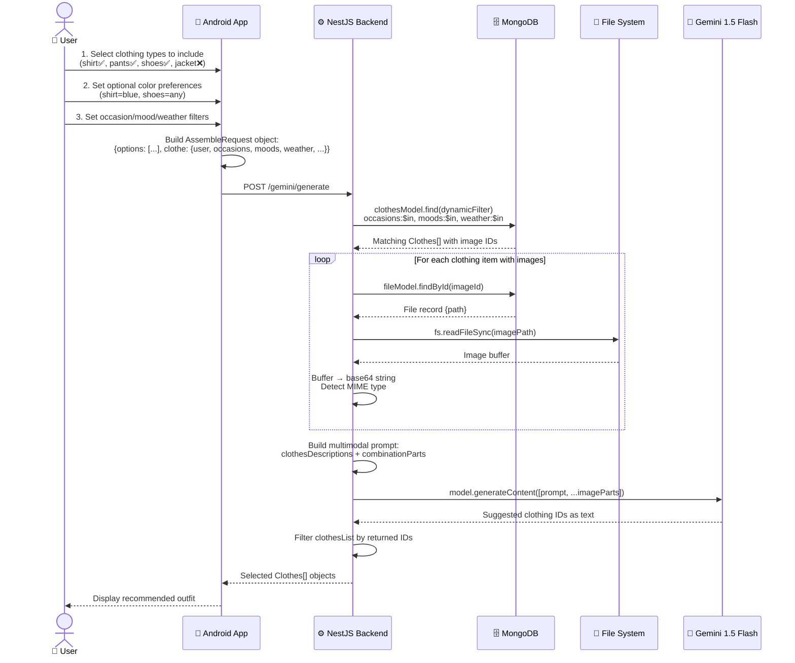

### 8.2 Prompt Construction Algorithm

The Gemini prompt is dynamically built from clothing metadata and user options. This is the core AI logic:

```typescript
private createPromptOption(optionDtos: OptionDto[], clothes: Clothes[]): string {
    // Step 1: Describe each clothing item with its index (matching image order)
    const clothesDescriptions = clothes
        .map((clothing, index) => 
            `- ${index} (index to link with image the same order) clothes with ` +
            `idClothes = ${clothing.id} which is a ${clothing.types} of color ${clothing.colors}.`
        )
        .join('\n');

    // Step 2: Build combination requirements from user options
    const generateCombinationPart = (type: string, option: OptionDto): string => {
        if (!option.enable) return '';                                    // Skip disabled types
        if (option.id) return `The ${type} with id "${option.id}"...`;   // Specific item
        else if (option.color) return `1 single ${type} of color "${option.color}".`;  // Color pref
        else return `1 single ${type}.`;                                 // Any matching item
    };

    const combinationParts = optionDtos
        .map((option) => generateCombinationPart(option.type, option))
        .filter((part) => part)
        .join('\n');

    return `Based on the following list of clothes and images (in the same order):
${clothesDescriptions}

I want a suggestion for a combination of:
${combinationParts}

Return only the idClothes of the suggested outfit in list string no description only list string`;
}
```

**Example Generated Prompt**:
```
Based on the following list of clothes and images (in the same order):
- 0 (index to link with image) clothes with idClothes = 65a1b2c3 which is a shirt of color blue,white.
- 1 (index to link with image) clothes with idClothes = 65a1b2c4 which is a pants of color black.
- 2 (index to link with image) clothes with idClothes = 65a1b2c5 which is a shoes of color brown.
- 3 (index to link with image) clothes with idClothes = 65a1b2c6 which is a shirt of color red.

I want a suggestion for a combination of:
1 single shirt of color "blue".
1 single pants.
1 single shoes.

Return only the idClothes of the suggested outfit in list string no description only list string
```

### 8.3 Image-to-Base64 Conversion Pipeline

```typescript
const imageParts = await Promise.all(
    clothes.map(async (cloth) => {
        if (cloth.images) {
            const fileRecord = await this.fileService.findOne(cloth.images);
            const imagePath = path.resolve(basePath, fileRecord.path);
            
            if (!fs.existsSync(imagePath)) return null;
            
            const mimeType = mime.lookup(imagePath) || 'image/*';
            const base64Data = Buffer.from(fs.readFileSync(imagePath)).toString('base64');
            
            return {
                inlineData: { data: base64Data, mimeType }
            };
        }
        return null;
    })
);
const validImageParts = imageParts.filter(part => part !== null);
```

### 8.4 Gemini API Call

```typescript
private async generateTextWithImages(prompt: string, imageParts: any[]): Promise<any> {
    const genAI = new GoogleGenerativeAI(this.geminiKey);
    const model = genAI.getGenerativeModel({ model: 'gemini-1.5-flash' });
    
    const result = await model.generateContent([prompt, ...imageParts]);
    // The model receives BOTH the text prompt AND all clothing images
    // It can visually analyze colors, patterns, and styles
    return result.response.text();
}
```

### 8.5 On-Device Camera Outfit Analysis

The Android app also has an **on-device Gemini integration** for outfit checking:

1. User opens camera via **CameraX** (`cameraView.kt`)
2. Captures photo of their current outfit
3. Image sent to **Google Generative AI SDK** (on-device, `geminiAnalyse.kt`)
4. AI provides feedback on outfit coordination, style harmony, and suggestions
5. Results displayed in a dialog (`analyze_outfit_dialogue.kt`)

### 8.6 Android-Side AI Request

```kotlin
interface GetReadyApi {
    @POST("gemini/generate")
    suspend fun generateAssemble(@Body assembleRequest: AssembleRequest): Response<List<Clothes>>
}

data class AssembleRequest(
    val options: List<Options>,
    val clothe: Clothes
)

data class Options(
    val enable: Boolean,
    val type: String,
    val id: String? = null,
    val color: String? = null
)
```

---

## 9. Database Design

### 9.1 Entity-Relationship Diagram

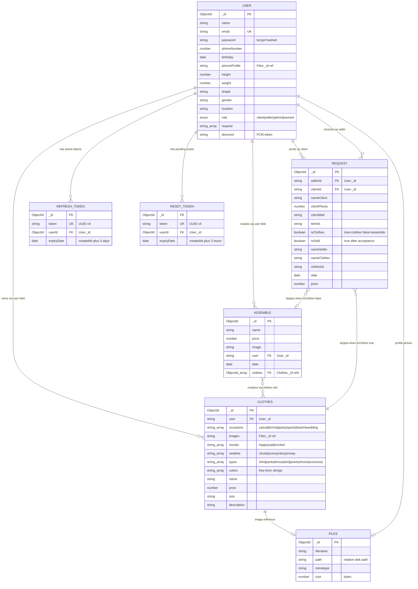

### 9.2 Key Query Patterns

| Collection | Common Query | MongoDB Operator |
|------------|-------------|-----------------|
| Users | Find by email (login) | `findOne({ email })` |
| Clothes | Filter by multiple criteria | `find({ occasions: { $in: [...] }, moods: { $in: [...] }, ... })` |
| Clothes | Get by user | `find({ user: userId })` |
| Assemble | Get by user + populate | `findOne({ user: id }).populate('clothes')` |
| Request | Duplicate check | `findOne({ clientId, itemId })` |
| Request | Delete competitors | `deleteMany({ clothesId, clientId: { $ne: winnerId } })` |
| RefreshToken | Validate token | `findOne({ token, expiryDate: { $gte: new Date() } })` |
| ResetToken | Consume token | `findOneAndDelete({ token })` |

---

## 10. Security & Authentication

### 10.1 Complete Authentication Flow

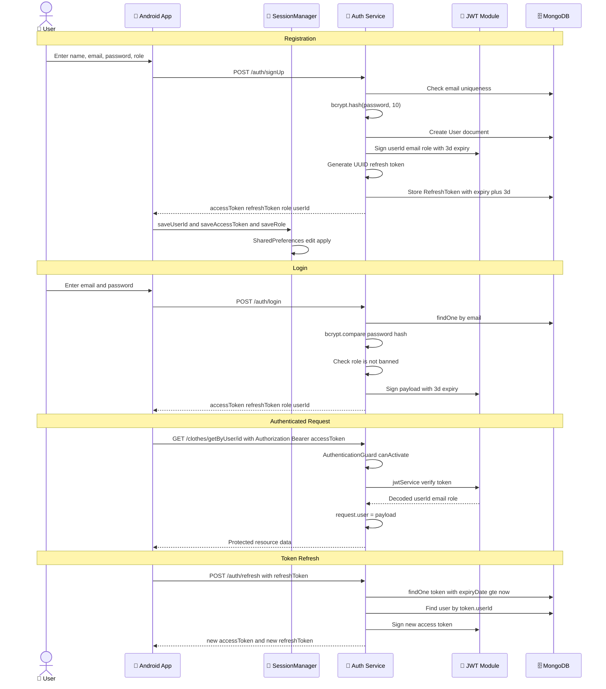

### 10.2 Security Measures Summary

| Layer | Measure | Implementation Detail |
|-------|---------|----------------------|
| **Password Storage** | bcryptjs hashing | Salt rounds: 10, `bcrypt.hash(password, 10)` |
| **Access Tokens** | JWT with expiration | Payload: `{userId, email, role}`, Expiry: 3 days |
| **Refresh Tokens** | UUID + MongoDB storage | `uuidv4()`, stored with expiry date, validated on use |
| **Reset Tokens** | UUID + auto-delete | `findOneAndDelete()` — single use, 3-hour window |
| **Route Protection** | `AuthenticationGuard` | Extracts Bearer token, verifies JWT, attaches payload to `request.user` |
| **Role-Based Access** | `@Roles()` decorator + `RoleGuard` | Checks `request.user.role` against allowed roles |
| **Banned Users** | Multi-point rejection | Checked at login (`auth.service`) AND profile access (`user.service`) |
| **CORS** | Open policy | `origin: '*'`, all methods allowed |
| **Input Validation** | class-validator decorators | `@IsEmail()`, `@MinLength(6)`, `@Matches(/^(?=.*[0-9])/)` |
| **Android Session** | SharedPreferences | `MODE_PRIVATE`, cleared on logout via `clearSession()` |

### 10.3 Custom Decorators

```typescript
// Role-based access control decorator
export const ROLES_KEY = 'roles';
export const Roles = (...roles: Role[]) => SetMetadata(ROLES_KEY, roles);

// Extract authenticated user from request
export const GetUser = createParamDecorator(
    (data: unknown, ctx: ExecutionContext): User => {
        const request = ctx.switchToHttp().getRequest();
        return request.user;
    },
);
```

---

## 11. Deployment & DevOps

### 11.1 Docker Architecture

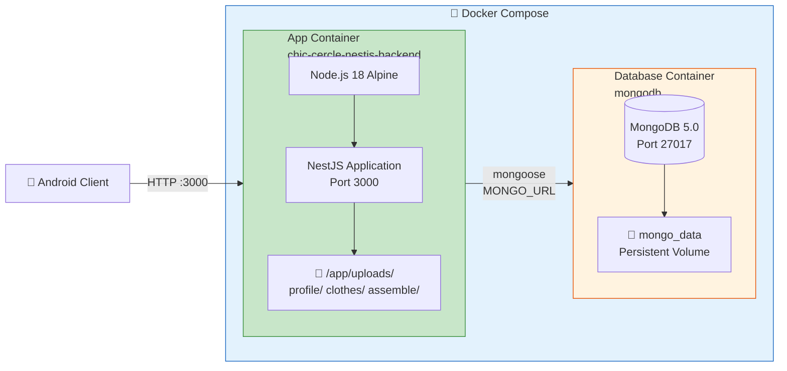

### 11.2 Dockerfile — Multi-Stage Build

```dockerfile
# Stage 1: Build
FROM node:18-alpine AS build
WORKDIR /app
COPY package*.json ./
RUN npm install
COPY . .
RUN npm run build

# Stage 2: Production
FROM node:18-alpine
WORKDIR /app
COPY --from=build /app/dist ./dist
COPY --from=build /app/node_modules ./node_modules
COPY package*.json ./
EXPOSE 3000
COPY .env /app/.env
CMD ["npm", "run", "start:prod"]
```

### 11.3 Docker Compose Configuration

```yaml
services:
  app:
    build: .
    container_name: chic-cercle-nestjs-backend
    image: ahmeddouss/chic-cercle-nestjs-backend:latest
    ports: ["3000:3000"]
    environment:
      - SECRET=${SECRET}
      - MONGO_URL=${MONGO_URL}
      - EMAIL_USER=${EMAIL_USER}
      - EMAIL_PASS=${EMAIL_PASS}
      - GEMINI_API_KEY=${GEMINI_API_KEY}
      - BASE_URL=${BASE_URL}
      - REMOVE_BG_API_KEY=${REMOVE_BG_API_KEY}
    env_file: [.env]
    networks: [ChicNetwork]
    depends_on: [mongodb]

  mongodb:
    image: mongo:5.0
    container_name: mongodb
    ports: ["27017:27017"]
    networks: [ChicNetwork]
    volumes: [mongo_data:/data/db]

networks:
  ChicNetwork:
    driver: bridge

volumes:
  mongo_data:
```

### 11.4 Environment Variables

| Variable | Purpose | Used By |
|----------|---------|---------|
| `SECRET` | JWT signing secret | JwtModule |
| `MONGO_URL` | MongoDB connection string | MongooseModule |
| `EMAIL_USER` | Gmail SMTP sender address | MailService |
| `EMAIL_PASS` | Gmail app password | MailService |
| `GEMINI_API_KEY` | Google Gemini API key | GeminiService |
| `BASE_URL` | Application base URL for reset links | MailService |
| `REMOVE_BG_API_KEY` | remove.bg API key | FilesService |
| `PROJECT_ID` | Firebase project ID | firebaseAdminProvider |
| `CLIENT_EMAIL` | Firebase service account email | firebaseAdminProvider |
| `PRIVATE_KEY` | Firebase private key | firebaseAdminProvider |

---

## 12. Testing

### 12.1 Backend Testing

The backend includes test files co-located with each module following NestJS conventions:

| Module | Unit Test Files | Framework |
|--------|----------------|-----------|
| Auth | `auth.service.spec.ts`, `auth.controller.spec.ts` | Jest |
| Clothes | `clothes.service.spec.ts`, `clothes.controller.spec.ts` | Jest |
| Assemble | `assemble.service.spec.ts`, `assemble.controller.spec.ts` | Jest |
| Gemini | `gemini.service.spec.ts`, `gemini.controller.spec.ts` | Jest |
| Files | `files.service.spec.ts`, `files.controller.spec.ts` | Jest |
| Request | `request.service.spec.ts`, `request.controller.spec.ts` | Jest |
| Firebase | `firebase.service.spec.ts`, `firebase.controller.spec.ts` | Jest |
| User | `user.service.spec.ts`, `user.controller.spec.ts` | Jest |
| E2E | `test/app.e2e-spec.ts` | Jest + Supertest |

**Test Commands**:
```bash
npm run test          # Unit tests (Jest)
npm run test:e2e      # End-to-end tests (Jest + Supertest)
npm run test:cov      # Coverage report
npm run test:watch    # Watch mode
```

### 12.2 Mobile Testing

| Type | Framework | Location |
|------|-----------|----------|
| Unit Tests | JUnit | `app/src/test/` |
| Instrumented Tests | AndroidJUnit4 | `app/src/androidTest/` |
| UI Tests | Compose Test | `ui-test-android` dependency |

---

## 13. Screenshots & User Interface

> *Note: Insert actual screenshots from the running application here.*

### 13.1 Custom UI Components

The app uses a library of reusable Compose components in `ui/commen/`:

| Component | File | Description |
|-----------|------|-------------|
| `CustomTextField` | `CustomTextField.kt` | Styled text input with rounded corners and themed colors |
| `CustomChoiceButton` | `CustomChoiceButton.kt` | Selectable chip/button for tags (occasion, mood, weather) |
| `CustomDropDown` | `CustomDropDown.kt` | Dropdown selector for enum values |
| `CustomDatePicker` | `CustomDatePicker.kt` | Date picker for outfit scheduling |
| `CustomNavBar` | `CustomNavBar.kt` | Bottom navigation bar (Market, Get Ready, Closet, Profile) |
| `CustomFonts` | `CustomFonts.kt` | Typography definitions |
| `BackgroundCircles` | `BackgroundCircles.kt` | Decorative circular background elements |

### 13.2 Screen Flow

| Screen | Key UI Elements |
|--------|----------------|
| **Login** | Background image, logo, email/password TextFields, "Forgot Password" link, Login button, Sign Up link |
| **Sign Up** | 3-page horizontal pager (Accompanist): credentials → personal info → preferences |
| **Closet** | Grid layout of clothing items with Coil image loading, filter chips, FAB for adding |
| **Add Clothing** | Photo capture, type/occasion/mood/weather tag selectors, color picker, size/description fields |
| **Get Ready** | Per-type toggle (enable/disable shirt, pants, shoes...), optional color pickers, AI generate button |
| **Marketplace** | Scrollable card list with clothing images, prices, "Send Request" button |
| **Seller Dashboard** | Request cards with buyer info, accept/reject buttons |
| **Profile** | User avatar (Coil from Files API), name, email, stats, Edit/Logout buttons |

---

## 14. Conclusion & Perspectives

### 14.1 Summary

Chic Cercle successfully demonstrates a production-quality full-stack mobile application integrating modern technologies:

- **Jetpack Compose** with Material 3 for a modern, declarative Android UI following MVVM architecture with `ViewModel`, `mutableStateOf`, and `LiveData`
- **NestJS** with TypeScript for a modular, dependency-injected backend with 8 feature modules, custom guards, and decorators
- **MongoDB** with Mongoose for flexible document storage with schema validation, enum constraints, and population joins
- **Google Gemini 1.5 Flash** for intelligent, multimodal outfit recommendations using dynamically constructed prompts with base64 clothing images
- **remove.bg API** for professional-grade automatic background removal in the upload pipeline
- **Firebase Cloud Messaging** for real-time push notifications with platform-specific configuration
- **Docker + Docker Compose** for containerized deployment with persistent storage

### 14.2 Key Technical Achievements

- ✅ Complete JWT authentication system with refresh token rotation, Google OAuth, and multi-step password reset
- ✅ Dynamic MongoDB query builder for multi-criteria clothing filtering using `$in` operators
- ✅ Multimodal AI pipeline: DB query → disk read → base64 conversion → prompt engineering → Gemini API → ID extraction
- ✅ Automatic image background removal integrated into the upload pipeline
- ✅ Marketplace transaction engine with ownership transfer and competing request cleanup
- ✅ Nested navigation architecture with role-based screen routing (client vs seller)
- ✅ Singleton data cache pattern (`DataInitializer`) for efficient data preloading
- ✅ CameraX integration for on-device outfit analysis

### 14.3 Future Perspectives

| Enhancement | Description |
|-------------|-------------|
| **iOS Version** | Extend to iOS using Kotlin Multiplatform (KMP) or SwiftUI |
| **Social Features** | Add outfit sharing, likes, comments, and user following |
| **Weather API Integration** | Auto-suggest outfits based on real-time weather data from OpenWeatherMap |
| **Advanced AI** | Fine-tune Gemini with user preference history for personalized style learning |
| **AR Try-On** | Augmented reality virtual clothing try-on using ARCore |
| **Payment Integration** | In-app payment processing via Stripe or Flouci (Tunisia) |
| **Recommendation Engine** | Collaborative filtering for fashion discovery based on similar users |
| **Multi-Language** | Arabic and French localization for Tunisian market |
| **Offline Mode** | Room database caching for offline wardrobe browsing |
| **CI/CD Pipeline** | GitHub Actions for automated testing, building, and Docker image publishing |

---

## Appendices

### A. Complete API Endpoints

| Module | Method | Endpoint | Auth | Description |
|--------|--------|----------|------|-------------|
| Auth | POST | `/auth/signUp` | ❌ | Register new user |
| Auth | POST | `/auth/google` | ❌ | Google OAuth |
| Auth | POST | `/auth/login` | ❌ | Login |
| Auth | POST | `/auth/refresh` | ❌ | Refresh tokens |
| Auth | PUT | `/auth/change-password` | ✅ | Change password |
| Auth | POST | `/auth/forgot-password` | ❌ | Send reset email |
| Auth | PUT | `/auth/reset-password` | ❌ | Reset with token |
| Auth | GET | `/auth/new-password/:token` | ❌ | Reset form HTML |
| Clothes | POST | `/clothes/addclothes` | ❌ | Add clothing |
| Clothes | GET | `/clothes` | ❌ | Get all clothes |
| Clothes | GET | `/clothes/getByUser/:id` | ❌ | Get user's clothes |
| Clothes | POST | `/clothes/filter` | ❌ | Filter clothes |
| Clothes | GET | `/clothes/:id` | ❌ | Get one |
| Clothes | PATCH | `/clothes/:id` | ❌ | Update |
| Clothes | DELETE | `/clothes/:id` | ❌ | Delete |
| Assemble | POST | `/assemble` | ❌ | Create outfit |
| Assemble | GET | `/assemble` | ❌ | Get all (populated) |
| Assemble | GET | `/assemble/:id` | ❌ | Get one (populated) |
| Assemble | GET | `/assemble/getByUser/:id` | ❌ | Get by user |
| Assemble | PATCH | `/assemble/:id` | ❌ | Update |
| Assemble | DELETE | `/assemble/:id` | ❌ | Delete |
| Gemini | POST | `/gemini/generate` | ❌ | AI outfit suggestion |
| Files | POST | `/file/upload/:type` | ❌ | Upload file |
| Files | GET | `/file/:id` | ❌ | Serve file |
| Files | GET | `/file` | ❌ | List all files |
| Request | POST | `/request` | ❌ | Create request |
| Request | GET | `/request` | ❌ | Get all requests |
| Request | GET | `/request/:id` | ❌ | Get one |
| Request | PATCH | `/request/:id` | ❌ | Accept/update |
| Request | DELETE | `/request/:id` | ❌ | Delete |
| Firebase | POST | `/firebase` | ❌ | Send push notification |
| Firebase | POST | `/firebase/send-notification` | ❌ | Send by token |
| User | POST | `/user` | ❌ | Create user |
| User | GET | `/user` | ❌ | Get all users |
| User | GET | `/user/:id` | ❌ | Get user |
| User | POST | `/user/addClothes/:id` | ❌ | Add clothes ref |
| User | PATCH | `/user/:id` | ❌ | Update user |
| User | DELETE | `/user/:id` | ❌ | Delete user |

### B. Project Structure

```
chic_cercle_backend-main/
├── src/
│   ├── main.ts                    — Bootstrap + CORS + Swagger
│   ├── app.module.ts              — Root module (Config, JWT, Mongoose, ServeStatic)
│   ├── Config/
│   │   ├── config.ts              — Environment variable loader
│   │   └── swagger.config.ts      — OpenAPI setup
│   ├── decorators/
│   │   ├── roles.decorators.ts    — @Roles() metadata decorator
│   │   └── user_decorator.ts      — @GetUser() param decorator
│   ├── auth/                      — Authentication module (service, controller, guard, DTOs, mail)
│   ├── clothes/                   — Wardrobe module (service, controller, DTOs, enums)
│   ├── assemble/                  — Outfit assembly module
│   ├── gemini/                    — AI integration module (prompt builder, Gemini API)
│   ├── files/                     — File upload module (Multer, remove.bg)
│   ├── request/                   — Marketplace requests module (ownership transfer)
│   ├── firebase/                  — Push notifications module (FCM)
│   └── user/                      — User management + all Mongoose schemas
├── docker-compose.yml
├── dockerfile
└── package.json

chic_cercle_android-master/
├── app/src/main/java/tn/esprit/chiccercle/
│   ├── MainActivity.kt           — Entry point + nested navigation graph
│   ├── data/
│   │   ├── network/              — 7 Retrofit API interfaces + MyRetrofit singleton
│   │   ├── persistance/          — SessionManager (SharedPreferences)
│   │   └── DataInitializer.kt    — Singleton data cache + preloader
│   ├── model/                    — 7 Kotlin data classes (Gson serialized)
│   ├── presentation/             — MVVM screens (View + ViewModel pairs)
│   │   ├── auth/                 — Login, SignUp (3-step), ForgotPassword, ResetPassword
│   │   ├── closet/               — Wardrobe grid + AI Gemini integration
│   │   ├── getReady/             — Outfit assembly + CameraX + Gemini analysis
│   │   ├── market/               — Buyer marketplace + Seller dashboard
│   │   └── profile/              — Profile view + edit
│   └── ui/                       — Theme (Material 3) + 6 reusable Compose components
└── app/build.gradle.kts
```

---

*Report generated from complete source code analysis — 70+ backend TypeScript files and 56 Android Kotlin files.*
